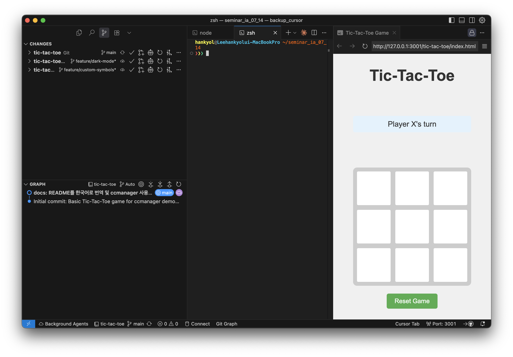
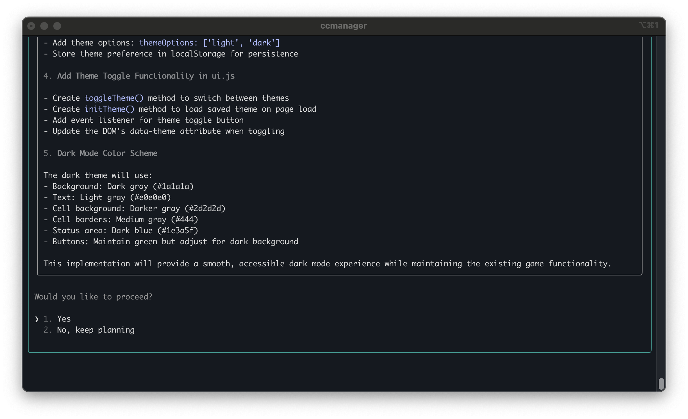
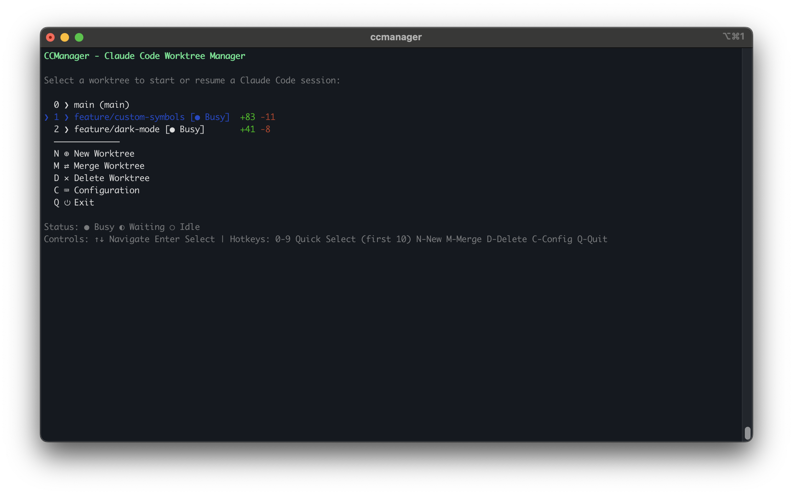
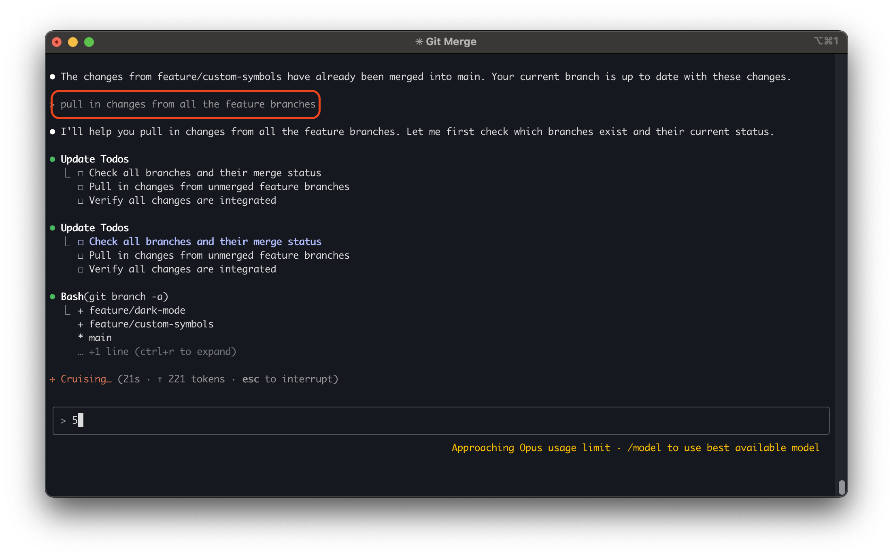
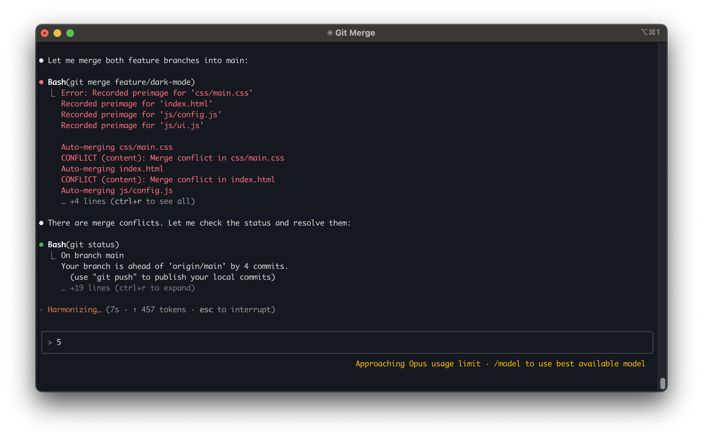
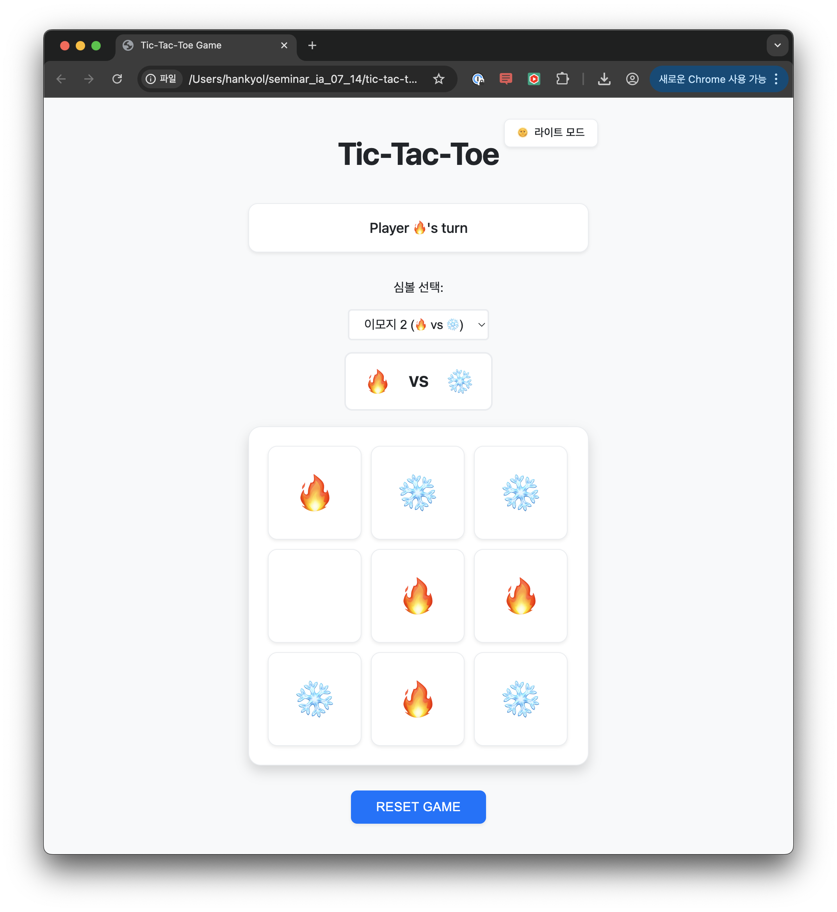
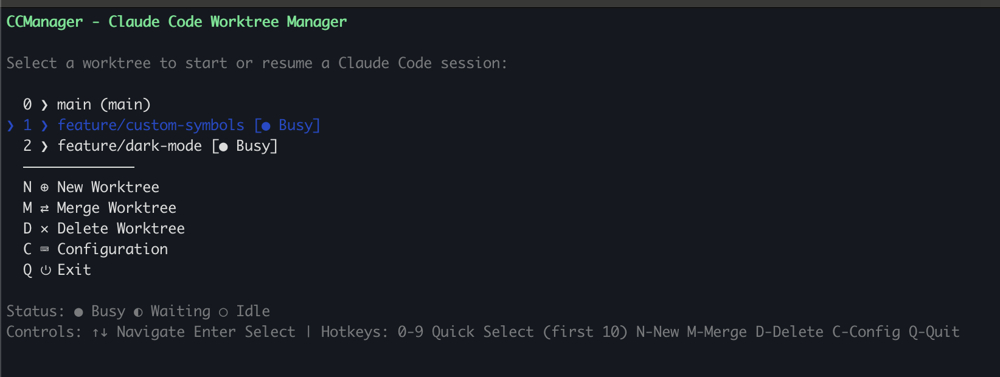

# Tic-Tac-Toe 게임 - ccmanager 병렬 개발 데모

ccmanager를 사용한 병렬 개발 워크플로우를 시연하기 위해 특별히 설계된 기본 Tic-Tac-Toe 게임입니다.

## 🎮 현재 기능
- 기본 2인 플레이어 Tic-Tac-Toe 게임
- 턴 기반 게임플레이 (X와 O)
- 가로, 세로, 대각선 승리 감지
- 무승부 감지
- 게임 리셋 기능

## 🛠️ 병렬 개발 실습

이 저장소는 두 명의 개발자가 ccmanager를 사용하여 서로 다른 기능을 동시에 작업할 수 있는 방법을 보여주도록 구성되어 있습니다.

### Feature A: 다크 모드 / 라이트 모드
- 테마 전환 기능 추가
- 테마를 위한 CSS 변수 구현
- UI에 토글 버튼 생성

### Feature B: 커스텀 심볼
- 하드코딩된 "X"와 "O"를 커스터마이징 가능한 심볼로 교체
- 심볼 선택 UI 추가
- 커스텀 심볼을 지원하도록 게임 로직 업데이트

## 📋 ccmanager 워크플로우 안내

### 1. ccmanager 설정

먼저 ccmanager가 설치되어 있는지 확인합니다:

```bash
npm install -g ccmanager
```

### 2. 병렬 개발을 위한 Worktree 생성

```bash
# ccmanager 실행
ccmanager

# ccmanager 메인 메뉴에서:
# 1. 'New Worktree' 선택 (또는 'N' 키 입력)
# 2. Feature A (다크 모드)를 위한 worktree 생성
#    - 디렉토리명: ../tic-tac-toe-dark-mode (또는 원하는 경로)
#    - 브랜치명: feature/dark-mode


# 3. 다시 'New Worktree' 선택 (또는 'N' 키 입력)
# 4. Feature B (커스텀 심볼)를 위한 worktree 생성
#    - 디렉토리명: ../tic-tac-toe-custom-symbols (또는 원하는 경로)
#    - 브랜치명: feature/custom-symbols
```


*ccmanager에서 새 worktree 생성 시 브랜치명 입력 화면*

### 3. 각 Worktree에서 AI 세션 시작

```bash
# ccmanager 메인 메뉴에서:
# 1. feature/dark-mode worktree 선택하여 Claude Code 세션 시작
# 2. Ctrl+E (또는 설정된 단축키)로 메뉴로 돌아가기
# 3. feature/custom-symbols worktree 선택하여 또 다른 Claude Code 세션 시작

# 이제 두 개의 AI 세션이 서로 다른 브랜치에서 동시에 실행됩니다
```


*VS Code에서 여러 worktree가 열려 있는 모습 - 각 브랜치에서 독립적인 개발 가능*

### 4. 병렬로 기능 구현


*각 Claude Code 세션에서 AI가 기능 구현을 계획하는 모습*

#### Worktree 1 - 다크 모드 기능:
"Feature A"로 표시된 TODO 주석을 찾아 작업:
- `index.html` - 테마 토글 버튼 추가
- `css/main.css` - 테마 변수 구현
- `js/ui.js` - 테마 토글 로직 추가
- `js/config.js` - 테마 설정 추가

#### Worktree 2 - 커스텀 심볼 기능:
"Feature B"로 표시된 TODO 주석을 찾아 작업:
- `index.html` - 심볼 선택 UI 추가
- `css/game.css` - 커스텀 심볼 스타일링
- `js/game.js` - 커스텀 심볼을 위한 게임 로직 업데이트
- `js/config.js` - 심볼 설정 추가


*각 기능 구현이 완료된 후 ccmanager에 표시되는 파일 변경 통계*

### 5. 기능 병합

병합은 두 가지 방법으로 수행할 수 있습니다:

#### 방법 1: ccmanager를 통한 병합
```bash
# ccmanager 메인 메뉴에서:
# 1. 'Merge Worktree' 선택 (또는 'M' 키 입력)
# 2. 병합할 브랜치 선택
# 3. main 브랜치로 병합
```

#### 방법 2: Claude Code를 통한 병합
Claude Code 세션 내에서 직접 병합을 요청할 수도 있습니다:


*Claude Code에 "pull in changes from all the feature branches"라고 요청하는 모습*

#### 병합 충돌 처리
병합 과정에서 충돌이 발생할 수 있습니다. Claude Code가 자동으로 감지하고 해결을 도와줍니다:


*Claude Code가 병합 충돌을 감지하고 해결하는 과정*

### 최종 결과

병합이 완료되면 두 기능이 모두 통합된 최종 애플리케이션을 확인할 수 있습니다:


*다크 모드와 커스텀 심볼(🔥 vs ❄️) 기능이 모두 구현된 최종 Tic-Tac-Toe 게임*

### 6. 세션 상태 모니터링

ccmanager의 주요 장점은 여러 세션의 상태를 한눈에 볼 수 있다는 것입니다:
- **Busy**: AI가 작업 중
- **Waiting**: 사용자 입력 대기 중
- **Idle**: 명령 대기 중
- **No status**: 세션이 시작되지 않음


*ccmanager에서 두 개의 worktree가 동시에 Busy 상태로 작업 중인 모습*

## 🚀 게임 실행 방법

브라우저에서 `index.html`을 열기만 하면 됩니다. 빌드 과정이 필요 없습니다!

## 📁 프로젝트 구조

```
tic-tac-toe/
├── index.html          # 메인 HTML 파일
├── css/
│   ├── main.css       # 레이아웃 및 테마 스타일
│   └── game.css       # 게임 전용 스타일
├── js/
│   ├── config.js      # 설정 모듈
│   ├── game.js        # 게임 로직
│   └── ui.js          # UI 상호작용
└── README.md          # 이 파일
```

## 💡 실습 팁

1. **기능 독립성**: 두 기능이 충돌 없이 개발될 수 있도록 코드가 구조화되어 있습니다
2. **명확한 분리**: CSS 변수를 사용하여 테마 구현이 게임 로직과 독립적입니다
3. **모듈식 JavaScript**: config, 게임 로직, UI를 위한 별도 모듈로 병렬 작업이 쉽습니다
4. **TODO 주석**: TODO 주석을 따라가며 코드를 추가할 위치를 정확히 알 수 있습니다

## 🔔 Post-hook 설정 (선택사항)

작업 완료 시 알림을 받으려면 Claude Code의 settings.json에서 post-hook을 설정할 수 있습니다:

```json
{
  "hooks": {
    "postWrite": "say '파일 저장 완료'",
    "postBash": "if [ $? -eq 0 ]; then say '명령 실행 성공'; else say '명령 실행 실패'; fi"
  }
}
```

즐거운 코딩 되세요! 🎉