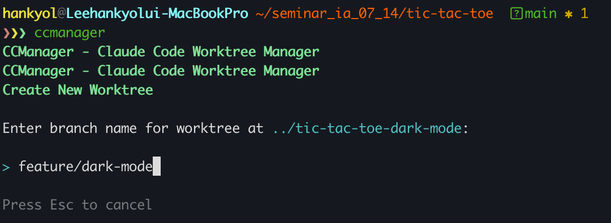

# 🎯 Tic-Tac-Toe - ccmanager 병렬 개발 데모

[ccmanager](https://github.com/kbwo/ccmanager)를 사용한 Claude Code 병렬 개발 워크플로우를 시연하는 Tic-Tac-Toe 게임입니다.

## 📌 목차
- [ccmanager란?](#ccmanager란)
- [데모 기능](#데모-기능)
- [빠른 시작](#빠른-시작)
- [세션 모니터링](#세션-모니터링)
- [최종 결과](#최종-결과)
- [프로젝트 구조](#프로젝트-구조)
- [게임 실행](#게임-실행)
- [개발 팁](#개발-팁)

## 🛠️ ccmanager란?

ccmanager는 **git worktree**를 활용하여 하나의 저장소에서 **여러 Claude Code 세션을 동시에** 실행할 수 있게 해주는 도구입니다. 이를 통해 충돌 없이 병렬 개발이 가능합니다.

## ✨ 데모 기능

이 데모는 두 가지 기능을 **병렬로 개발**하는 방법을 보여줍니다:

| 기능 | 설명 |
|------|------|
| **Feature A** | 다크/라이트 모드 토글 |
| **Feature B** | 커스텀 심볼 (X/O 대체) |

## 🚀 빠른 시작

### 1️⃣ ccmanager 설치
```bash
npm install -g ccmanager
```

### 2️⃣ Worktree 생성
```bash
ccmanager
# 'N' 키를 눌러 New Worktree 선택
# feature/dark-mode 브랜치 생성
# feature/custom-symbols 브랜치 생성
```

  
*ccmanager에서 새 worktree 생성 시 브랜치명 입력 화면*

### 3️⃣ 병렬 세션 시작
ccmanager에서 각 worktree를 선택하여 **독립적인 Claude Code 세션**을 시작합니다.

  

### 4️⃣ 기능 개발
각 세션은 독립적으로 해당 기능 브랜치에서 작업합니다.

  
*각 Claude Code 세션에서 AI가 기능 구현을 계획하는 모습*

### 5️⃣ 변경사항 병합
Claude Code에 직접 요청하여 브랜치를 병합합니다.

  
*Claude Code에 "pull in changes from all the feature branches"라고 요청하는 모습*

**병합 충돌** 발생 시 Claude Code가 자동으로 해결을 도와줍니다:

  
*Claude Code가 병합 충돌을 감지하고 해결하는 과정*

## 📊 세션 모니터링

ccmanager는 모든 세션의 **실시간 상태**를 보여줍니다:

| 상태 | 설명 |
|------|------|
| **Busy** | AI 작업 중 |
| **Waiting** | 사용자 입력 대기 |
| **Idle** | 명령 대기 |

  
*ccmanager에서 두 개의 worktree가 동시에 Busy 상태로 작업 중인 모습*

### 작업 완료 후

  
*각 기능 구현이 완료된 후 ccmanager에 표시되는 파일 변경 통계*

## 🎉 최종 결과

  
*다크 모드와 커스텀 심볼(🔥 vs ❄️) 기능이 모두 구현된 최종 Tic-Tac-Toe 게임*

## 📁 프로젝트 구조

```
tic-tac-toe/
├── index.html          # 메인 HTML 파일
├── css/
│   ├── main.css       # 레이아웃 및 테마 스타일
│   └── game.css       # 게임 전용 스타일
├── js/
│   ├── config.js      # 설정 모듈
│   ├── game.js        # 게임 로직
│   └── ui.js          # UI 상호작용
└── README.md          # 이 파일
```

## 🎮 게임 실행

브라우저에서 `index.html`을 열기만 하면 됩니다. **빌드 과정이 필요 없습니다!**

## 💡 개발 팁

- **모듈화된 코드**: 충돌 없는 병렬 개발을 위한 구조
- **TODO 주석**: 기능 추가 위치 명확히 표시
- **독립적 기능**: 각 기능은 독립적이고 모듈식으로 구현
- **CSS 변수**: 테마와 게임 로직의 완전한 분리